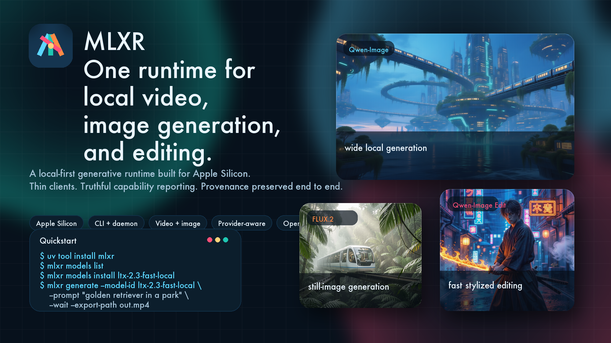
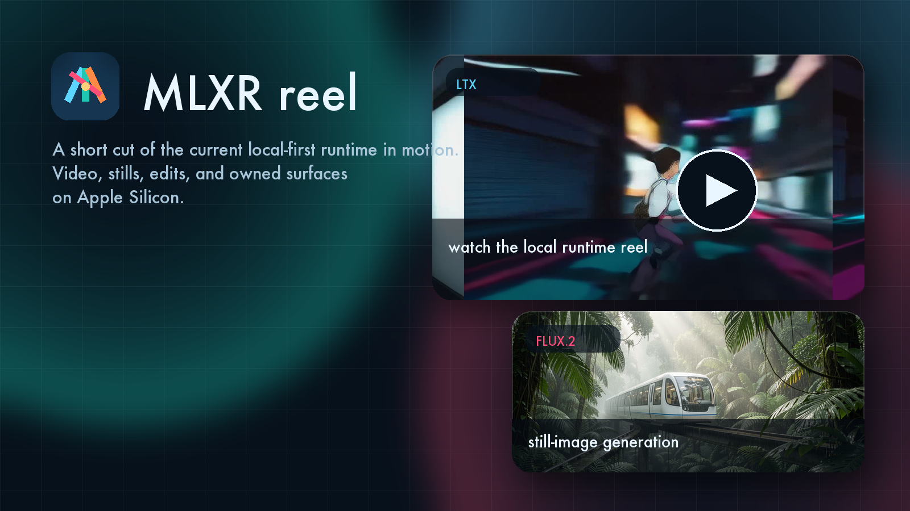
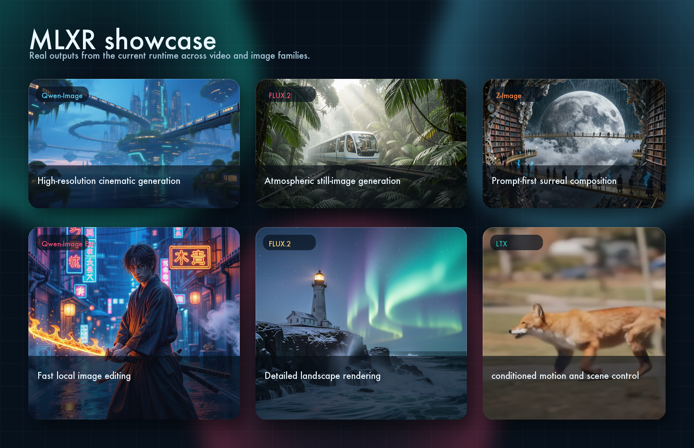

# MLXR

<p align="center">
  <picture>
    <source media="(prefers-color-scheme: dark)" srcset="docs/assets/brand/mlxr-logo-light.svg">
    <source media="(prefers-color-scheme: light)" srcset="docs/assets/brand/mlxr-logo-dark.svg">
    
  </picture>
</p>

<p align="center">
  <strong>Local-first MLX runtime for Apple Silicon.</strong><br>
  One runtime for video, image generation, editing, provenance, and thin clients.
</p>

<p align="center">
  Python • MLX • Apple Silicon • <code>uv</code> • daemon + CLI
</p>

<p align="center">
  <a href="docs/current-status.md">Current status</a>
  ·
  <a href="docs/roadmap.md">Roadmap</a>
  ·
  <a href="docs/cli-ergonomics.md">CLI</a>
  ·
  <a href="docs/mac-app-v1-product-spec.md">Mac app v1</a>
  ·
  <a href="docs/open-source-release-checklist.md">Release checklist</a>
</p>

<p align="center">
  
</p>

`MLXR` means `MLX Runtime`.

It is a local-first generative runtime built for Apple Silicon: one shared runtime, many thin surfaces, explicit provenance, and support claims that stay tied to real receipts instead of hope.

The project is already a real runtime with a real CLI and real family slices for video and image generation. It is not yet a frozen public API or a finished desktop app. The next product step is a simple native Mac app over the same runtime.

## See It In Motion

<p align="center">
  <a href="docs/assets/readme/mlxr-reel.mp4">
    
  </a>
</p>

<p align="center">
  Open the poster to play a short 720p reel built from current runtime outputs.
</p>

## Showcase

<p align="center">
  
</p>

## Why MLXR

- One shared runtime, many thin surfaces. The daemon owns jobs, artifacts, provenance, and workflow planning; clients stay thin over it.
- Local-first by design. Transport is UDS-first, data flow is handle-based, and the repo is built around Apple Silicon reality rather than generic local-serving assumptions.
- Truthful capability reporting. Rows are promoted only after real receipts, not because upstream has a feature name.
- Cross-family pressure matters. `LTX`, `Qwen-Image`, `FLUX.2`, and `Z-Image` all push the runtime toward reusable platform seams instead of one-family hacks.

## What Is Real Today

- A shared runtime with source, artifact, provenance, and job models.
- A local daemon API with UDS-first transport and handle-based import and export.
- A first-party `mlxr` CLI with `generate`, `serve`, `doctor`, `models list`, `models install`, and `feedback`.
- Promoted `LTX` fast video slices.
- Real `Qwen-Image`, `FLUX.2`, and `Z-Image` image-family slices.
- Public docs for current status, roadmap, open-source maintenance, and the first Mac app direction.

What is not true yet:

- A stable v1 public API.
- A released first-party Mac app.
- Complete desktop or Comfy adapters.
- A fully closed cross-family benchmark matrix.

## Quickstart

Published CLI flow:

```bash
uv tool install mlxr
mlxr
mlxr models list
mlxr models install ltx-2.3-fast-local
mlxr generate --model-id ltx-2.3-fast-local --prompt "golden retriever in a park" --wait --export-path out.mp4
```

Repo-local flow:

```bash
uv sync
uv run mlxr
```

## Current Best Lanes

- `LTX fast` for text-to-video and image-to-video.
- `LTX conditioned-audio` for the strongest current audio-conditioned video lane.
- `Qwen-Image` for the strongest local image generation and editing story.
- `FLUX.2 klein-9b` for straightforward still-image generation and single-reference edit.
- `Z-Image Turbo` for prompt-first still-image generation.

For the exact truth by family, use:

- [LTX capability matrix](docs/research/11-ltx-capability-matrix.md)
- [Qwen-Image capability matrix](docs/research/26-qwen-image-capability-matrix.md)
- [FLUX.2 capability matrix](docs/research/23-flux2-capability-matrix.md)
- [Z-Image family candidate](docs/research/20-z-image-family-candidate.md)

## Start Here

If you want to understand the project quickly:

- [Current status](docs/current-status.md)
- [Roadmap](docs/roadmap.md)
- [CLI ergonomics](docs/cli-ergonomics.md)
- [Mac app v1 product spec](docs/mac-app-v1-product-spec.md)
- [Open-source maintenance model](docs/open-source-maintenance.md)

If you want the platform docs:

- [Product requirements](docs/01-product-requirements.md)
- [Technical design](docs/02-universal-mlx-runtime-design.md)
- [Phased delivery plan](docs/03-phased-delivery-plan.md)
- [Benchmark matrix](docs/benchmark-matrix.md)
- [Workflow orchestration design](docs/workflow-orchestration-design.md)
- [Provider and provenance model](docs/provider-and-provenance-model.md)
- [Model acquisition and cache](docs/model-acquisition-and-cache.md)
- [Operations and packaging](docs/operations-and-packaging.md)

## Development

The repo uses a `uv` workspace rooted at the top-level `pyproject.toml`.

```bash
uv sync
uv run mlxr --help
uv run python scripts/dev.py verify
uv run python scripts/dev.py logs
uv run pre-commit run --all-files
```

`verify` is the main acceptance gate.

If you are contributing, start with:

- [CONTRIBUTING.md](CONTRIBUTING.md)
- [SECURITY.md](SECURITY.md)
- [CODE_OF_CONDUCT.md](CODE_OF_CONDUCT.md)
- [SUPPORT.md](SUPPORT.md)
- [AGENTS.md](AGENTS.md)
- [MEMORY.md](MEMORY.md)

## License And Models

The repository code is released under [Apache-2.0](LICENSE).

Model families preserve upstream model licenses independently. A permissive repo license does not make upstream model weights redistributable.

_Last verified: 2026-03-12_
