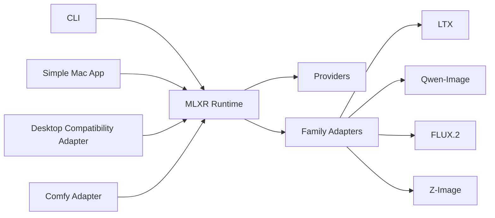

# MLXR

Last verified: 2026-03-12

`MLXR` is a local-first MLX runtime for Apple Silicon.

It is built around one idea:

- one shared runtime
- many thin surfaces
- truthful capability reporting
- provider and provenance preserved end to end

Today, `MLXR` is already a real runtime with a real CLI and real family slices
for video and image generation. It is not yet a frozen public API or a finished
desktop product.

## What Is Real Today

- a shared runtime with source, artifact, provenance, and job models
- a local daemon API with UDS-first transport and handle-based import or export
- a first-party `mlxr` CLI thin client
- promoted LTX fast video slices
- real Qwen-Image, FLUX.2, and Z-Image image-family slices
- growing cross-family validation pressure

What is not true yet:

- a stable v1 public API
- complete desktop or Comfy adapters
- a released first-party Mac app
- a fully closed cross-family benchmark matrix

## Runtime Shape



The runtime is the source of truth. Clients and adapters stay thin over it.

## Public Status

| Area | Current status |
| --- | --- |
| Shared runtime | real |
| Local daemon API | real |
| `mlxr` CLI | real |
| `ltx-desktop` adapter | planned |
| Comfy adapter | planned |
| First-party Mac app | planned next |
| Embedded Apple-first host access | planned later |

## Current Best Answers

If someone asks what to use today, the clean answers are:

- LTX fast for text-to-video and image-to-video
- LTX conditioned-audio for the current promoted audio-conditioned slice
- Qwen-Image for the strongest local image generation and editing path
- FLUX.2 `klein-9b` for straightforward local still-image generation and
  single-reference edit
- Z-Image for prompt-only still-image generation

For the detailed truth by family, use:

- [LTX capability matrix](docs/research/11-ltx-capability-matrix.md)
- [Z-Image family candidate](docs/research/20-z-image-family-candidate.md)
- [Qwen-Image capability matrix](docs/research/26-qwen-image-capability-matrix.md)
- [FLUX.2 capability matrix](docs/research/23-flux2-capability-matrix.md)

## First Open-Source Milestone

The current milestone is:

1. make the runtime and CLI public, legible, and trustworthy
2. clean up docs, roadmap, and contribution posture
3. prepare a simple native Mac app over the same runtime

That first app is intentionally smaller than the later `MLXR Studio` vision.

## Start Here

- [Current status](docs/current-status.md)
- [Roadmap](docs/roadmap.md)
- [Product requirements](docs/01-product-requirements.md)
- [Technical design](docs/02-universal-mlx-runtime-design.md)
- [Phased delivery plan](docs/03-phased-delivery-plan.md)
- [Benchmark matrix](docs/benchmark-matrix.md)
- [CLI ergonomics](docs/cli-ergonomics.md)
- [Mac app v1 product spec](docs/mac-app-v1-product-spec.md)
- [Open-source release checklist](docs/open-source-release-checklist.md)
- [Open-source maintenance model](docs/open-source-maintenance.md)

## CLI

The current public CLI is `mlxr`.

First-run flow from a published install:

```bash
uv tool install mlxr
mlxr
mlxr models list
mlxr models install ltx-2.3-fast-local
mlxr generate --model-id ltx-2.3-fast-local --prompt "golden retriever in a park" --wait --export-path out.mp4
```

Current repo-local flow:

```bash
uv sync
uv run mlxr
```

The CLI now includes:

- `mlxr generate`
- `mlxr serve`
- `mlxr doctor`
- `mlxr models list`
- `mlxr models install`
- `mlxr feedback`

## Platform Docs

- [Workflow orchestration design](docs/workflow-orchestration-design.md)
- [Capability schema](docs/capability-schema.md)
- [Provider and provenance model](docs/provider-and-provenance-model.md)
- [Model acquisition and cache](docs/model-acquisition-and-cache.md)
- [Operations and packaging](docs/operations-and-packaging.md)

## Research And Family Docs

- [LTX next-phase task list](docs/research/15-next-phase-task-list.md)
- [LTX capability closure plan](docs/research/25-ltx-capability-closure-plan.md)
- [Qwen-Image family candidate](docs/research/21-qwen-image-family-candidate.md)
- [FLUX.2 family candidate](docs/research/22-flux2-family-candidate.md)

## Development

The repo uses a `uv` workspace rooted at the top-level `pyproject.toml`.

```bash
uv sync
uv run mlxr --help
uv run python scripts/dev.py verify
uv run python scripts/dev.py logs
uv run pre-commit run --all-files
```

`verify` is the main acceptance gate.

## Repo Layout

```text
mlxr/
  README.md
  AGENTS.md
  MEMORY.md
  docs/
  packages/
    core/
    families/
    clients/
    adapters/
  references/
    official/
    ecosystem/
  scripts/
```

The `references/` tree is for upstream inspection and is intentionally not the
repo's implementation source.

## Operating Docs

- [AGENTS.md](AGENTS.md)
- [MEMORY.md](MEMORY.md)
- [agent-native-development.md](docs/agent-native-development.md)
- [dev-harness.md](docs/dev-harness.md)
- [skill-policy.md](docs/skill-policy.md)

## License And Models

The repo code is intended to be released under Apache-2.0.

Model families preserve upstream model licenses independently. A permissive repo
license does not make upstream model weights redistributable.
