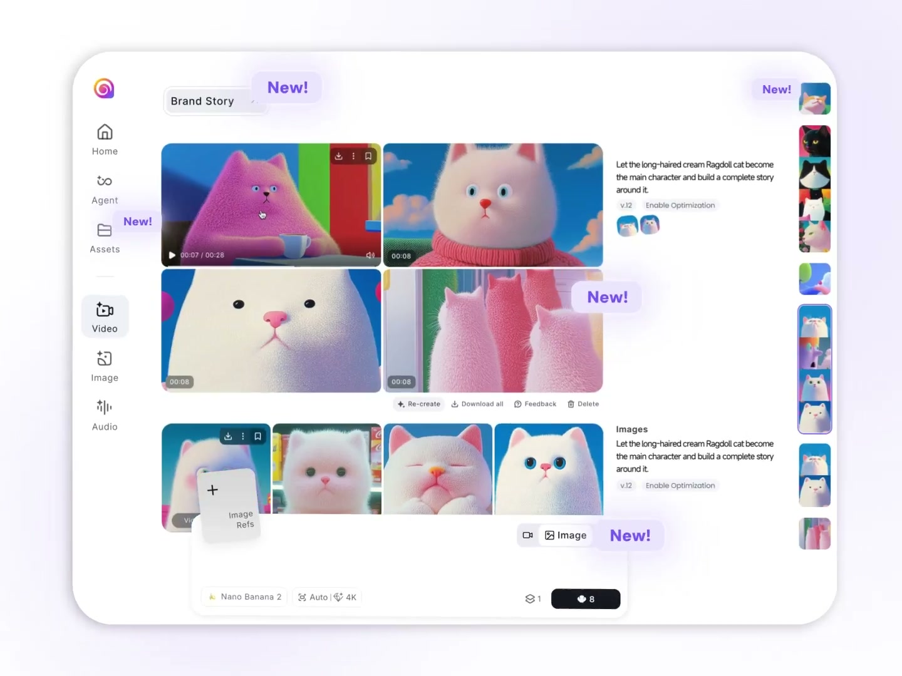
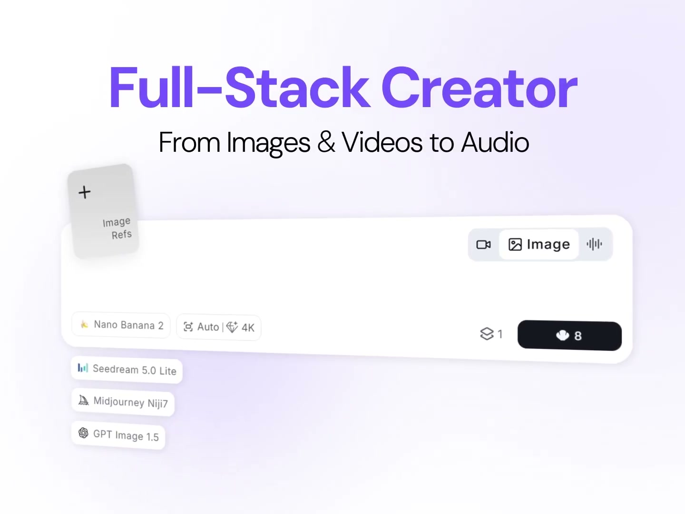
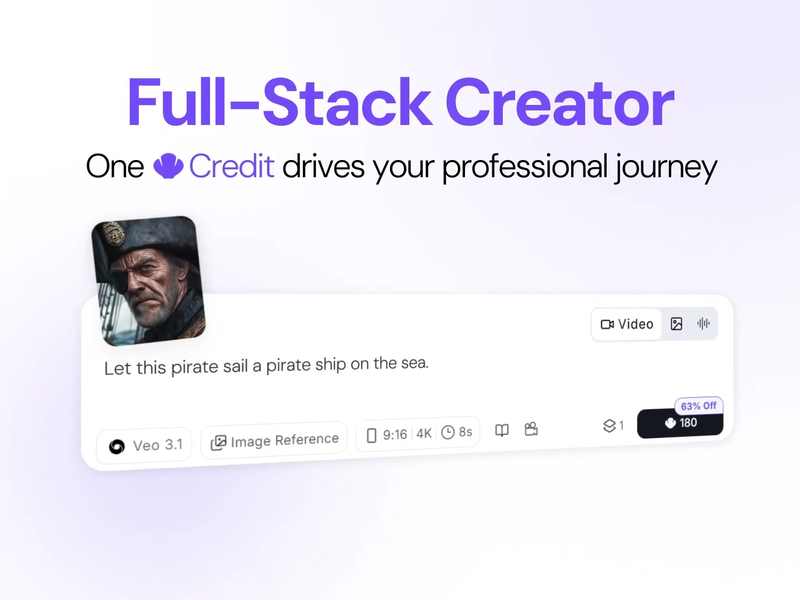
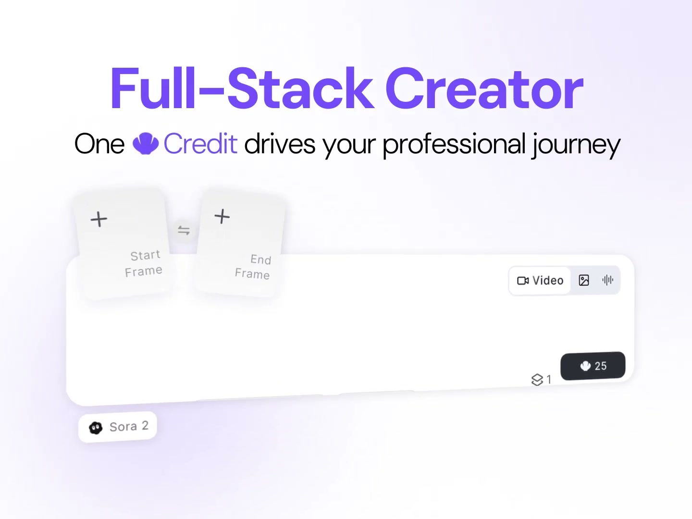
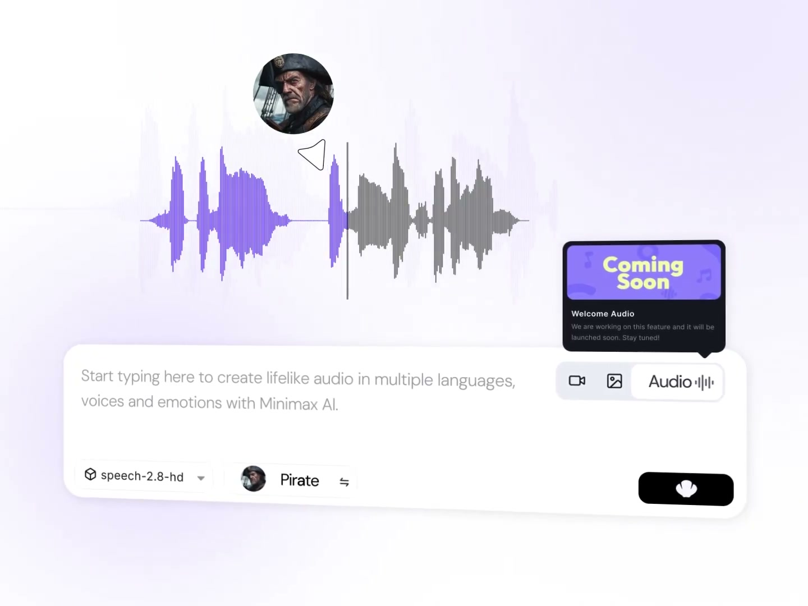
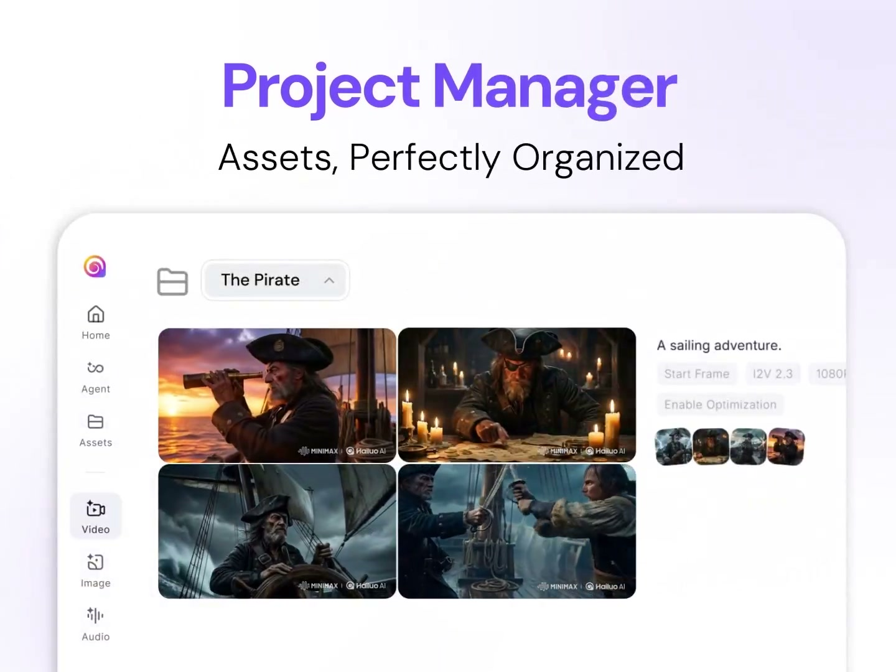
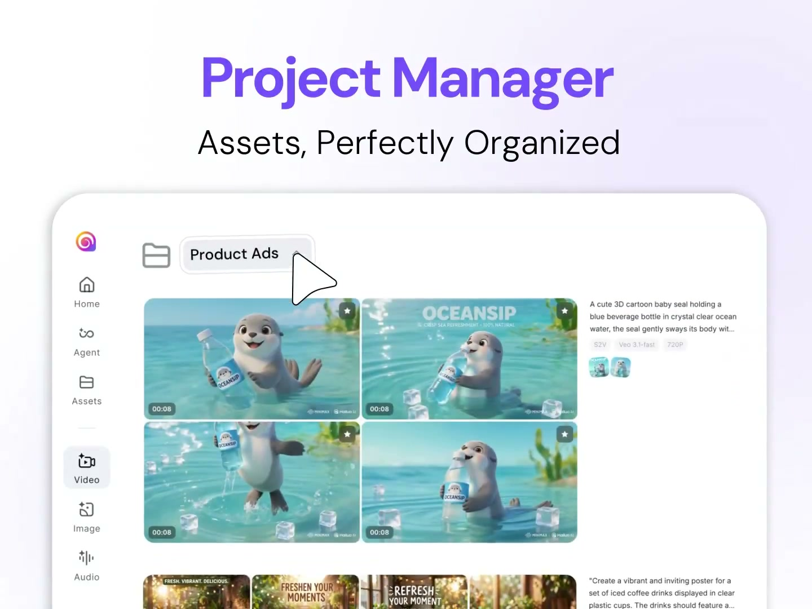
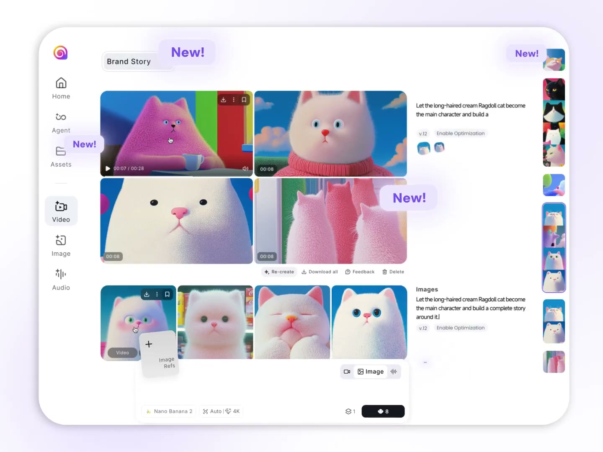

# MLXR App: Definitive Interface Design

Status: non-normative visual brief — the numbered stage plans are the implementation spec

This is the UI blueprint for the MLXR Mac App — a consumer-friendly local
creative tool for image and video creation on Apple Silicon, with
audio-conditioned video as a supporting workflow rather than a standalone mode.

Reference: Hailuo AI "Brand Story" (MiniMax, March 2025).
There is one app. Not a phased "simple v1" then "Studio later" split.

## Normative Status

This file is the visual brief and design rationale for the unified studio direction.

The normative implementation spec lives in:

- `docs/working/unified-studio/00-master-plan.md`
- the numbered stage plans in `docs/working/unified-studio/`

If this brief and the stage plans differ, the stage plans win for implementation once they explicitly close a question.

## Visual Reference (Hailuo AI)

Read each image below carefully. These are the UX patterns to follow.

### The full workspace — sidebar, results grid, prompt bar, right filmstrip


### The floating prompt bar — image mode with model dropdown


### The floating prompt bar — video mode with image reference attached


### The floating prompt bar — video mode with start/end frame slots


### Future-facing audio reference — not a phase-1 primary mode


### Project Manager — "The Pirate" project with assets and metadata


### Project Manager — "Product Ads" project with video grid


### Workspace with inline actions (re-create, download, feedback, delete)


---

The audio-mode screenshot is retained as a visual reference only. It does not
override the locked phase-1 decision in `00-master-plan.md`: `MLXR` supports
audio-conditioned video, not standalone audio creation, so audio remains a
video sub-workflow instead of a top-level segmented mode.

## Why the Current UX Feels Wrong

The current layout is a 3-pane HSplitView (sidebar / canvas / inspector)
that looks and feels like a developer tool:

- **11 workflow options in a sidebar** — "Make Image", "Edit Image",
  "Make Video", "Animate Image", "Video From Sound", "Guide With Video",
  "Blend Frames", "Retake Clip", "Upscale", "Transcribe", "Podcast Episode".
  A normal person sees this and closes the app.
- **Always-visible inspector panel** — model picker, pack picker, quality
  presets, references card, advanced card with raw Width/Height/Steps/FPS
  fields. Takes up ~380px of screen width showing controls most users
  never touch.
- **GlassCards with subtitles explaining everything** — "What do you want
  to do? Start with a verb, not a technical pipeline." The UI shouldn't
  need to explain itself. If it does, the UI is wrong.
- **Prompt lives in a card labeled "Prompt"** — with helper text and a
  submit button in the corner. It should just BE there, obvious, central.
- **Results and creation are the same pane** — the canvas shows either an
  empty state, a progress ring, or a result. You lose the result when you
  switch workflows.
- **Creation is trapped behind an internal `Studio` seam** — it should feel
  global instead of like a special place you enter.
- **Library is a separate place** — you leave the creation context to
  browse assets, then navigate back to use one.

---

## Design Principles

1. **The prompt bar IS the app.** Everything else exists to support it.
2. **You're always in a project.** Assets appear where you made them.
3. **Switch modality, not workflow.** Video / Image — not 11 pipeline names.
4. **Show results, not controls.** Settings hide until you need them.
5. **Create anywhere that creation makes sense.** The prompt bar is visible on
   `Home` and `Library`, not trapped inside `Studio`.
6. **Local is a feature, not a limitation.** Show runtime status proudly.

---

## Navigation Model

```text
+----+----------------------------------------------------------+
| NR |  Workspace                                               |
|    |                                                          |
| Hm |  [active view fills this space]                          |
|    |                                                          |
| Lb |                                                          |
|    |                                                          |
| Md |                                                          |
|    |                                                          |
| -- |  +----------------------------------------------------+ |
| St |  | Prompt Bar (floating, bottom, visible on creation   | |
|    |  | surfaces)                                           | |
| Ac |  +----------------------------------------------------+ |
+----+----------------------------------------------------------+

NR = NavRail (icon-only, ~64px)
Hm = Home, Lb = Library, Md = Models, St = Settings, Ac = Activity
```

### Nav rail items

| Icon | Label | Purpose |
|---|---|---|
| sparkles | (none — logo/home) | Dashboard, recent projects, quick start |
| folder | Library | Browse all projects and assets |
| square.stack.3d.up | Models | Install, manage, remove local models |
| gear | Settings | Runtime, prompt helper, diagnostics |
| bolt.circle | Activity | Running jobs, install queue (badge count) |

### What is NOT in the nav rail

- **Studio / Create** — there is no creation destination. The prompt bar
  is global. When you're on Home or Library, you can still type and generate.
  Results land in the current project (or create a new one).
- **Workflow list** — gone. Replaced by the modality switcher in the prompt bar.

### Default view on launch

1. If the user has a recent project with results → open Library filtered to
   that project, prompt bar pre-loaded with last prompt.
2. If the user has models installed but no results → open Home with a
   "Start creating" card. Prompt bar visible and ready.
3. If no models installed → open Models with the first-run setup flow.

---

## The Prompt Bar

This is the single most important component. It replaces the current
`StudioCanvasView` prompt area, `StudioSidebarView` workflow picker, and
`StudioInspectorView` model/settings panel.

### Anatomy (video mode)

```text
+-----------------------------------------------------------------------+
| [img ref]  [+ Add]                                  [Video ● | Image] |
|                                                                       |
|  "A pirate sailing through a storm at sunset"                         |
|                                                                       |
| [LTX Fast v]  [16:9]  [Standard]  [8s]   Ready          [Generate >] |
+-----------------------------------------------------------------------+
```

### Anatomy (image mode)

```text
+-----------------------------------------------------------------------+
| [img ref]  [+ Add]                                  [Video | Image ●] |
|                                                                       |
|  "A portrait of a weathered sea captain"                              |
|                                                                       |
| [FLUX.2 v]  [3:4]  [Standard]  [×4]      Ready          [Generate >] |
+-----------------------------------------------------------------------+
```

### Component breakdown

| Component | Position | Behavior |
|---|---|---|
| Reference slots | Top left | Tilted card thumbnails. Click [+] to import or pick from library. Slots adapt to modality — see Reference Slots section. |
| Modality switcher | Top right | Segmented control: Video / Image. Changes what settings and reference slots are visible. Audio-conditioned work remains a video sub-workflow. |
| Prompt text field | Center | Multi-line, auto-expanding. Placeholder: "What do you want to make?" |
| Model pill | Bottom left | Shows active model name + icon. Tap → popover with installed models for this modality. "Get more models" link to Models view. |
| Aspect pill | Bottom left | "16:9", "1:1", "9:16", "4:3". Tap to cycle or open picker. |
| Quality pill | Bottom left | "Draft", "Standard", "Cinema". Tap to cycle. |
| Duration pill | Bottom left | "4s", "8s", "12s". Only visible in Video mode. Tap to cycle. |
| Variation count | Bottom left | "×1", "×2", "×4". Only visible in Image mode. Tap to cycle. |
| Runtime status | Bottom right | "Ready", "Generating…", "Installing model", or "Runtime unavailable". Small text, not a button. |
| Generate button | Bottom right | Prominent, filled. Shows "Generate" or a spinner when busy. Disabled with tooltip if model not installed or references missing. |

### Prompt Helper

When the prompt helper model is installed and mode is not Off:

```text
| [Suggest v]  "Enhanced: A weathered sea captain with salt-and-pepper  |
|              beard, dramatic lighting, oil painting style..."         |
|              [Accept] [Dismiss]                                       |
```

The suggestion appears as a subtle expansion below the prompt field.
Original text stays editable above. Accept replaces the prompt. Dismiss
hides the suggestion.

### Advanced settings (Tune popover)

A gear icon at the right edge of the settings row opens a popover:

```text
+---------------------------+
| Tune                      |
|                           |
| Width      [  768  ]      |
| Height     [  512  ]      |
| Steps      [   20  ]      |
| Guidance   [  7.5  ]      |
| Seed       [ random ]     |
| Format     [PNG | JPG]    |
| Neg prompt [ _________ ]  |
|                           |
| [Reset to recommended]    |
+---------------------------+
```

Most users never open this. Power users get everything they need.

### Reference slots — adaptive by modality and workflow

| Modality | Default slots | When user picks a sub-workflow |
|---|---|---|
| Image (generate) | Optional image ref | — |
| Image (edit) | Required source image | User drops an image or picks from library |
| Video (generate) | None | — |
| Video (animate) | Required source image | Labeled "Start Frame" |
| Video (interpolate) | Start Frame + End Frame | Two image slots appear |
| Video (audio-conditioned) | Required audio file | Audio waveform slot |
| Video (video-conditioned) | Required guide video | Video thumbnail slot |
| Video (retake) | Required source video | Video thumbnail slot |

When a user drops a reference that implies a specific workflow (e.g., drops
an image while in Video mode), the bar auto-selects "Animate Image" and
shows the appropriate label. The user doesn't need to know the workflow name.

### Sub-workflow discovery

The modality switcher has a small chevron or long-press that reveals
sub-workflows:

```text
Video ▾
├─ Generate from text        (default)
├─ Animate an image
├─ Use audio as a guide
├─ Use video as a guide
├─ Blend between frames
└─ Retake a clip

Image ▾
├─ Generate from text        (default)
└─ Edit an existing image
```

These use plain language, not pipeline names. Selecting one adjusts
reference slots and the model picker filters.

---

## The Canvas (Results View)

Above the prompt bar, the canvas shows results and project context. It has
three states:

### State 1: Empty (no project, no results)

```text
+-----------------------------------------------------------------------+
|                                                                       |
|              [sparkles icon]                                          |
|              Type a prompt below to start creating.                   |
|              Your results will appear right here.                     |
|                                                                       |
+-----------------------------------------------------------------------+
| [Prompt Bar]                                                          |
+-----------------------------------------------------------------------+
```

Clean, minimal. No cards, no explanations, no metrics. Just an invitation.

### State 2: Generating (job in progress)

```text
+-----------------------------------------------------------------------+
|  [Project: The Pirate v]                                    [⚙ Tune] |
|                                                                       |
|  +--------------------------------------------------+                 |
|  |                                                  |                 |
|  |           [progress ring / bar]                  |                 |
|  |           Loading model... 18%                   |                 |
|  |           "A pirate sailing through a storm"     |                 |
|  |                                                  |                 |
|  +--------------------------------------------------+                 |
|                                                                       |
|  Previous results (if any):                                           |
|  +------+ +------+ +------+                                          |
|  | vid1 | | vid2 | | img1 |                                          |
|  +------+ +------+ +------+                                          |
|                                                                       |
+-----------------------------------------------------------------------+
| [Prompt Bar]                                                          |
+-----------------------------------------------------------------------+
```

Progress shows inline where the next result will land. Previous results
scroll below. The user sees continuity — their work is building up.

### State 3: Results ready

```text
+-----------------------------------------------------------------------+
|  [Project: The Pirate v]                         [+ New Project]      |
|                                                                       |
|  Latest:                                                              |
|  +-----------------------+  +-----------------------+                 |
|  |                       |  |                       |                 |
|  |   [> Play] 00:08      |  |   [> Play] 00:08      |                 |
|  |                       |  |                       |                 |
|  +-----------------------+  +-----------------------+                 |
|  +-----------------------+  +-----------------------+                 |
|  |                       |  |                       |                 |
|  |   [image]             |  |   [image]             |                 |
|  |                       |  |                       |                 |
|  +-----------------------+  +-----------------------+                 |
|                                                                       |
|  "A pirate sailing through a storm at sunset"                         |
|  LTX Fast · 720p · 16:9 · 8s                                         |
|  [Re-create] [Edit] [Animate] [Reveal in Finder] [Delete]            |
|                                                                       |
|  Earlier:                                                             |
|  +------+ +------+ +------+ +------+                                 |
|  | ...  | | ...  | | ...  | | ...  |                                 |
|  +------+ +------+ +------+ +------+                                 |
|                                                                       |
+-----------------------------------------------------------------------+
| [Prompt Bar]                                                          |
+-----------------------------------------------------------------------+
```

Results display as a 2-column grid (or adaptive based on window width).
Each result group shows:
- Generated assets as thumbnails (video with play button and duration,
  images as stills)
- The prompt that generated them
- Compact metadata line (model, resolution, aspect, duration)
- Inline action buttons

Clicking a result opens it as the hero (large preview with video player
or image viewer). Clicking an action like "Edit" or "Animate" drops the
asset into the prompt bar's reference slot and switches to the appropriate
sub-workflow.

### Result group actions

| Action | Behavior |
|---|---|
| Re-create | Same prompt + settings, new seed. Starts generating immediately. |
| Edit | Drops into Image > Edit, sets the image as reference, preserves prompt. |
| Animate | Drops into Video > Animate, sets the image as start frame. |
| Use as reference | Adds to the prompt bar's reference slots for the current modality. |
| Reveal in Finder | Opens the output directory in Finder. |
| Delete | Removes the result group (with confirmation). |

---

## Library

The Library is a **project browser**. It replaces the current flat grid +
filter rail layout with project-first organization.

### Layout

```text
+-----------------------------------------------------------------------+
| NavRail |  Library                                                    |
|         |                                                             |
|         |  [Search...]  [All | Video | Image | Audio]     [+ Import]  |
|         |                                                             |
|         |  Recent Projects:                                           |
|         |  +-------+ +-------+ +-------+ +-------+                   |
|         |  |Pirate | |Ads    | |Cyber  | |Cats   |                   |
|         |  |[hero] | |[hero] | |[hero] | |[hero] |                   |
|         |  |3 vids | |8 imgs | |5 vids | |12 imgs|                   |
|         |  +-------+ +-------+ +-------+ +-------+                   |
|         |                                                             |
|         |  ── or, selected project expanded: ──                       |
|         |                                                             |
|         |  [< Back]  The Pirate                                       |
|         |  +--------+ +--------+ +--------+ +--------+               |
|         |  | vid 1  | | vid 2  | | img 1  | | img 2  |               |
|         |  | 00:08  | | 00:08  | |        | |        |               |
|         |  +--------+ +--------+ +--------+ +--------+               |
|         |                                                             |
|         |  "A pirate sailing through a storm"                         |
|         |  LTX Fast · 720p · 16:9 · 8s · 2 references                |
|         |  [Re-create] [Open in Finder] [Delete Group]                |
|         |                                                             |
+-----------------------------------------------------------------------+
| [Prompt Bar — still visible, can create from here]                    |
+-----------------------------------------------------------------------+
```

### Projects

A **project** is a named container for related creative work:

- Auto-created when the user first generates. Name defaults to a truncation
  of the first prompt (editable).
- Groups run groups that share a creative thread.
- Shows a hero thumbnail (latest generated asset).
- Displays counts by media type.

Under the hood, a project is the user-facing name for `WorkspaceRecord`, with
`RunGroupRecord` as the iteration unit and `CollectionRecord` staying secondary
for later saved sets or favorites workflows.

### Browsing within a project

Clicking a project card expands it to show all assets in a grid. The grid
groups assets by run group (prompt + settings), with metadata and actions
inline — exactly like the Hailuo "Brand Story" view.

### Media type filter

The [All | Video | Image | Audio] segmented control at the top filters
which assets are visible. This maps directly to `LibraryAssetFilter` but
with a simpler, Hailuo-style horizontal segmented control instead of the
current `LibraryFilterRail` sidebar.

### The prompt bar in Library

The prompt bar remains visible at the bottom of Library. If the user types
a prompt and generates while viewing a project, the results land in that
project. If on the top-level project grid, a new project is created.

---

## Home

A simple landing page. Not a dashboard with metrics.

### For new users (no models installed)

```text
+-----------------------------------------------------------------------+
|  Welcome to MLXR                                                      |
|                                                                       |
|  Everything runs locally on your Mac.                                 |
|  Install a model to start creating.                                   |
|                                                                       |
|  Recommended:                                                         |
|  +------------------------------------------+                        |
|  | LTX Video 2.3 Fast       12 GB  [Install]|                        |
|  | Local video generation on Apple Silicon   |                        |
|  +------------------------------------------+                        |
|  | FLUX.2 Image             8 GB   [Install]|                        |
|  | High-fidelity still images                |                        |
|  +------------------------------------------+                        |
|                                                                       |
+-----------------------------------------------------------------------+
| [Prompt Bar — disabled until a model is installed]                    |
+-----------------------------------------------------------------------+
```

### For returning users (has models + results)

```text
+-----------------------------------------------------------------------+
|  Recent Projects:                                                     |
|  +-------+ +-------+ +-------+                                       |
|  |Pirate | |Ads    | |Cats   |   [View all in Library →]              |
|  +-------+ +-------+ +-------+                                       |
|                                                                       |
|  Quick start:                                                         |
|  [Make a video]  [Make an image]  [Continue last project]             |
|                                                                       |
|  Runtime: Connected · 2 models installed · 47 creations               |
|                                                                       |
+-----------------------------------------------------------------------+
| [Prompt Bar]                                                          |
+-----------------------------------------------------------------------+
```

Clean, minimal, action-oriented. No GlassCards with subtitles.

---

## Models

Largely unchanged from current `ToolkitScreen`. This is the one area where
a more information-dense layout is appropriate — users are making a
deliberate decision about what to install.

Additions:
- **Example output thumbnails** per model so users see what they're getting.
- **Hardware fitness summary** — "Recommended for your Mac" / "May be slow
  on 32GB" based on the runtime capability schema.
- **Disk usage** — show how much space each installed model uses.

---

## Activity

The current `ActivityCenterSheet` overlay works well. Keep it as a popover
from the nav rail badge. Shows:

- Running jobs with progress
- Model install queue with progress
- Completed/failed jobs (dismissible)

One change: when a job is running, show a subtle progress indicator in the
prompt bar itself (e.g., the Generate button becomes a progress ring, or a
thin progress bar appears at the top edge of the prompt bar).

---

## User Flows

### Flow 1: First launch

1. App opens → Models view with first-run setup.
2. User installs LTX Fast (recommended).
3. Download completes → app transitions to Home with "Start creating" prompt.
4. User types a prompt → generates → results appear in canvas → project
   auto-created.

### Flow 2: Make a video

1. User is on Home or Library.
2. Types prompt in the floating bar. Modality is already set to Video.
3. Clicks Generate.
4. Progress shows inline in the canvas.
5. Result appears. User watches it. Likes it.
6. Types a new prompt, generates again. New result appears above the old one.

### Flow 3: Animate an image

1. User has an image result visible.
2. Clicks "Animate" on the result.
3. Prompt bar switches to Video mode. The image appears as a "Start Frame"
   reference in the prompt bar. Prompt text is preserved.
4. User clicks Generate. Video result appears.

### Flow 4: Iterate on a concept

1. User generates 4 image variations (×4 in prompt bar).
2. Results appear as a 2×2 grid.
3. User clicks the best one → it becomes the hero preview.
4. Clicks "Use as reference" → it drops into the prompt bar's reference slot.
5. Tweaks the prompt → generates again with the reference.

### Flow 5: Browse and continue

1. User opens Library. Sees project cards.
2. Clicks "The Pirate" project. Sees all pirate-themed assets.
3. Clicks a video result. It opens as the hero.
4. Types a new prompt in the (still-visible) prompt bar.
5. Generates. New result lands in "The Pirate" project.

### Flow 6: Switch modality mid-session

1. User is generating videos of a pirate.
2. Clicks "Image" in the modality switcher.
3. Reference slots and settings adapt (duration disappears, variation
   count appears). Model picker switches to image models.
4. Prompt stays. User generates an image of the same pirate.
5. Image result appears in the same project.

---

## How MLXR Capabilities Map to the Simple UI

| MLXR capability | Where it lives in the new UI |
|---|---|
| `image.generate` | Image modality (default) |
| `image.edit` | Image modality → sub-workflow "Edit an existing image" |
| `video.generate` | Video modality (default) |
| `video.condition.image` | Video modality → sub-workflow "Animate an image", or auto-detected when image ref is dropped |
| `video.condition.audio` | Video modality → sub-workflow "Use audio as a guide" |
| `video.condition.video` | Video modality → sub-workflow "Use video as a guide" |
| `video.interpolate` | Video modality → sub-workflow "Blend between frames" |
| `video.retake` | Video modality → sub-workflow "Retake a clip" |
| Prompt enhancement | Prompt helper toggle in the prompt bar |
| Model install/management | Models view (nav rail) |
| Runtime status | Small indicator in prompt bar + Settings view |
| Quality/aspect/duration | Pill selectors in prompt bar |
| Advanced settings | Tune popover (gear icon in prompt bar) |
| References | Visual thumbnail slots in prompt bar (adaptive) |
| Activity/progress | Inline progress in canvas + Activity overlay |
| Library/assets | Library view with project-first organization |
| Favorites/collections | Project-level grouping replaces collections |

---

## Performance Considerations

- **Thumbnail caching** — the existing `LibraryThumbnailStore` handles this.
  The new grid views should use the same lazy-loading pattern.
- **Prompt bar rendering** — must stay lightweight. No heavy computed
  properties in the bar's body. All planning/readiness checks happen in
  `MLXRAppModel` and are passed down as simple values.
- **Canvas scroll** — use `LazyVStack` for the results list. Don't load
  all video players upfront — only the hero and visible thumbnails.
- **Modality switching** — should feel instant. No full view teardown.
  The prompt bar adapts its visible controls via ternary expressions on
  the modality value, preserving structural identity.

---

## Code Mapping

### New views to create

| View | Replaces | Purpose |
|---|---|---|
| `OmniPromptBar` | Parts of `StudioCanvasView`, `StudioSidebarView`, `StudioInspectorView` | The floating prompt bar |
| `CanvasResultsView` | `StudioCanvasView` (preview area only) | Results display, hero preview, project context |
| `ProjectGridView` | `LibraryGridView` (partially) | Project cards for Library top-level |
| `ProjectDetailView` | `LibraryWorkspaceView` (partially) | Expanded project view with assets grid |
| `TunePopover` | `StudioInspectorView` (advanced card) | Advanced settings popover |

### Views to remove

| View | Reason |
|---|---|
| `StudioScreen` | Replaced by canvas + prompt bar in `RootView` |
| `StudioSidebarView` | Workflow list eliminated; reference picking moves to prompt bar |
| `StudioInspectorView` | Model/settings move to prompt bar; advanced to Tune popover |
| `StudioCanvasView` | Split into `CanvasResultsView` (results) + `OmniPromptBar` (input) |
| `LibraryFilterRail` | Replaced by simpler top toolbar filter |

### Views to keep (with modifications)

| View | Changes |
|---|---|
| `RootView` | Add prompt bar as global overlay. Remove Studio destination from nav. |
| `HomeScreen` | Simplify to recent projects + quick start. Remove GlassCards/metrics. |
| `GalleryScreen` | Refactor to project-first layout. Keep modal viewer. |
| `LibraryViewerSheet` | Keep as-is — the modal preview is good. |
| `LibraryThumbnailStore` | Keep — thumbnail caching is needed. |
| `ToolkitScreen` | Keep — model management is already well-designed. |
| `SettingsScreen` | Keep. |
| `ActivityCenterSheet` | Keep. |
| `NavRail` | Remove Studio item. Add Activity badge item. |

### Domain layer (no changes needed)

The existing domain types are well-designed and map directly:

| Type | Maps to |
|---|---|
| `StudioWorkspaceDraft` | Prompt bar state (prompt, model, settings, references) |
| `ProductTask` | Modality + sub-workflow selection |
| `WorkflowPlanResult` | Capability adaptation (reference slots, readiness) |
| `LibraryAsset` | Result display in canvas and library |
| `RunGroupRecord` | Project grouping foundation |
| `WorkspaceRecord` | Project container and durable project backing type |
| `CatalogSnapshot` | Model picker in prompt bar |

---

## Remaining Visual Question

1. **Right-edge filmstrip** — Hailuo has a vertical filmstrip on the right
   edge showing all generated assets. This is useful for quick navigation
   but takes screen width. The current locked phase-1 direction keeps the
   in-canvas grid and hero preview instead; revisit the filmstrip only if
   later project-density testing shows a real navigation problem.
